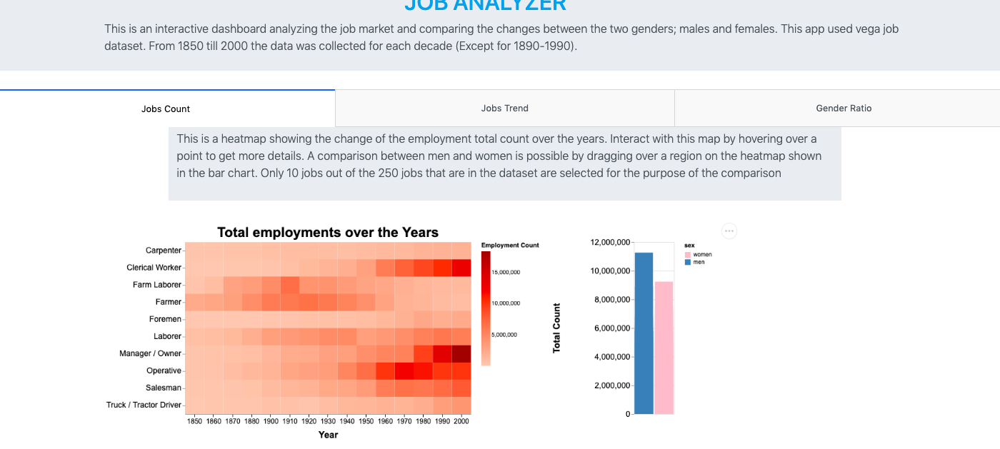
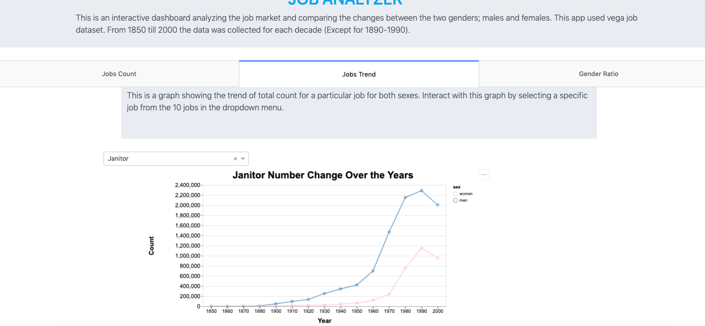
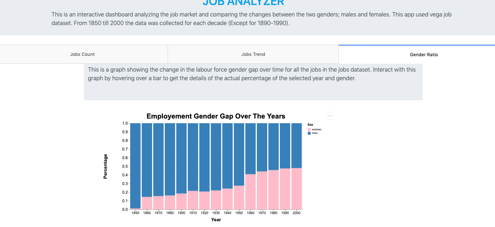

# DSCI 532: Group 107 - Job Analyzer

Dataset: The `Jobs` data from the `vega-datasets` python package.

[Deployed App](https://group107-job-milestone2.herokuapp.com/)

# App Functionality

The app has three tabs each containing different plots addressing different questions:

**Tab 1 (Job Count)**:

This tab contains two plots connected to each other; a heatmap and a bar chart. The heatmap shows the change in the total count of employments for 10 jobs over 150 years from 1850 till 2000. The heatmap is equipped with interactive features allowing the users to get details by hovering over points and further compare the total employment counts for men and women shown in the bar chart by selecting an area in the heatmap. 

**Tab 2 (Jobs Trend):**

In this tab the user can select a job from the dropdown menu and will be able to see the trend of the total count change and compare it for both genders.

**Tab 2 (Gender Ratio)**

This tab contains a bar chart that shows how the labor force gender gap changed over the years. The plot is also equipped with an interactive feature that helps the user get details of the ratios by hovering over the plot. 

**Team Members**

- Ke Xin (Margaret) Zhao
- Simardeep Kaur
- Eithar Elbasheer

## Sketch Description:

The purpose of this app is to show how the distribution of jobs changed over years along with separate spreads for both men and women. These trends help us to analyse how the professions for both men and women changed over time. 

The app contains three tabs: 
- The first tab contains two plots connected to each other’s. The first plot is a heatmap for the selected 10 jobs showing the change of the total count of employment over the years (in a 10-year time step). The heatmap is interactive, and a tooltip shows the value of the total count for the specific job for the selected year. Upon selection on the heatmap the second plot changes to reflect the job selected. The second plot shows a comparison between the total count for men and women for the specific year. 

- The second tab contains a plot showing the trend of total count for a particular job for both sexes. The job can be selected from the dropdown menu. The dropdown menu contains different jobs to be selected from.

- The last tab contains a bar plot to show the change in the labour force gender gap over time. It has an interactive tooltip that shows the actual percentage of the selected year and gender.

